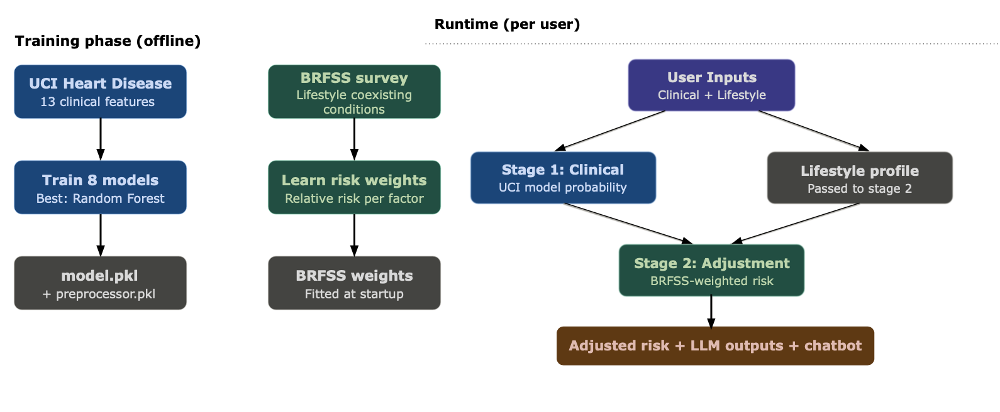

# 🫀 Heart Disease Risk Predictor & Diet Assistant AI

A machine learning health application that estimates heart disease risk from BRFSS-style health, demographic, lifestyle, and chronic-condition survey inputs. The app also includes an AI assistant layer that can generate diet suggestions, risk explanations, lifestyle guidance, and a doctor's-note style summary.

> **Medical disclaimer:** This project is for educational use only. It does not diagnose disease, replace a clinician, or provide emergency medical care.

---
## Project Summary

This project focuses on predicting whether a user is likely to be in the heart disease risk class using BRFSS survey-derived features. The model was trained on `brfss_2024_eda_processed.csv`, with `HadHeartDisease` as the target variable.

The project combines:

- A BRFSS-trained binary classification model
- A preprocessing pipeline saved as a pickle artifact
- A Streamlit/FastAPI app interface
- A Groq-powered chatbot and recommendation layer
- Generated outputs for diet plans, risk reports, lifestyle advice, and doctor-note summaries

---

## Running the App

### Prerequisites
Make sure you have the following installed:
- Python 3.9+
- pip

### Setup

1. **Create and activate a virtual environment**
```bash
   python -m venv .venv
   source .venv/bin/activate        # Mac/Linux
   .venv\Scripts\activate           # Windows
```

2. **Install dependencies**
```bash
   pip install -r requirements.txt
```

3. **Add your Groq API key**

   Get a free key at [console.groq.com](https://console.groq.com)
   Create a `.env` file in the project root: Write GROQ_API_KEY=your_key_here

4. **Download the data files**

   Download the following file from [Shared Drive](https://drive.google.com/drive/folders/1Do-WD_58u01GXPyg8ScpCBZtyY61Kdw6?usp=sharing) and place them in the project root:
   - `brfss_survey_data_processed.csv`

5. **Run the training pipeline** (generates `artifact/model.pkl` and `artifact/preprocessor.pkl`)
```bash
   python src/mlproject/pipelines/training_pipelines.py
```

6. **Launch the app**
```bash
   streamlit run streamlit_app.py
```
   The FastAPI backend starts automatically in the background.

### Notes
- User profiles are saved locally in `profiles/` and are not committed to the repo.
- Do not commit `.env` or any `.csv` files.
  
---

## 🎯 Overview

## 📊 Data

The model uses BRFSS 2024 processed survey data. BRFSS captures health behavior, chronic condition, demographic, and lifestyle information across the United States. The final BRFSS training script uses 24 input features:

### Demographics and socioeconomic variables

- `Sex`
- `AgeCategory`
- `Education`
- `Income`
- `EmploymentStatus`
- `MaritalStatus`
- `HomeOwnership`

### General health and body measures

- `GeneralHealth`
- `GoodOrBetterHealth`
- `LastCheckup`
- `Height`
- `Weight`

### Health behaviors

- `Smoked100Cigarettes`
- `SmokerStatus`
- `ECigaretteUsage`
- `SmokelessTobaccoUse`
- `AlcoholDays`
- `PhysicalActivities`

### Existing conditions and comorbidities

- `HadDiabetes`
- `HadKidneyDisease`
- `HadStroke`
- `HadCOPD`
- `HadDepressiveDisorder`
- `HadArthritis`


## 🏗️ Architecture

The project presentation describes the system as a two-stage architecture: a clinical prediction stage and a BRFSS/lifestyle adjustment stage. The current codebase contains both the older UCI-style clinical pipeline pieces and the newer BRFSS training script.


```markdown

```


### Current code architecture

```text
User input
   ↓
Streamlit frontend
   ↓
FastAPI backend
   ↓
Preprocessing pipeline
   ↓
Random Forest BRFSS model
   ↓
Risk prediction
   ↓
Groq AI assistant layer
   ↓
Diet plan, risk report, lifestyle advice, doctor note, chatbot response
```

---

## 🔍 App Features

The application includes:

- Heart disease risk prediction
- Diet plan generation
- Risk report generation
- Lifestyle advice
- Doctor's-note style summary
- Sidebar chatbot
- Multilingual response support

The AI assistant uses Groq chat completions to generate natural-language responses from the user profile and prediction result.

---

## 🛠️ Tech Stack

- Python
- Pandas
- NumPy
- Scikit-learn
- Streamlit
- FastAPI
- Groq API
- FPDF
- python-dotenv
- Matplotlib
- MLflow

---

