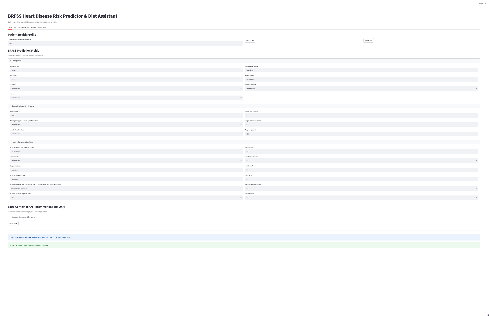

# 🫀 Heart Disease Prediction & AI Diet Assistant

<p align="center">
  
  
  
  
  
</p>

<p align="center">
  <strong>A Streamlit + FastAPI healthcare prototype for BRFSS-based heart disease risk prediction and AI-powered diet, lifestyle, risk report, and doctor note support.</strong>
</p>

<p align="center">
  <a href="https://heart-diseasefrontend-5a7a8554af50.herokuapp.com/">🌐 Live App</a> •
  <a href="#-features">✨ Features</a> •
  <a href="#-architecture">🏗️ Architecture</a> •
  <a href="#-tech-stack">🛠️ Tech Stack</a> •
  <a href="#-quick-start">🚀 Quick Start</a>
</p>

---

## 🎯 Overview


This project is a production-style **Streamlit web application** that predicts heart disease risk using machine learning models and enhances the experience with **AI-powered diet, lifestyle, and medical recommendations**.

It combines:

* Classical ML for medical risk prediction
* Experiment tracking with MLflow
* Generative AI for personalized healthcare guidance
* A clean, interactive Streamlit frontend

Built during **May–June**, with focus on real-world usability and deployment readiness.

## What We Updated

This project is based on an existing heart disease prediction and AI diet assistant application. The original version already included a Streamlit/FastAPI app, machine learning prediction pipeline, and AI-generated diet/lifestyle support features.

Our update focuses on **Option B**, which fully retrains the prediction model using BRFSS features only. The updated model no longer depends on hard-to-answer UCI clinical fields such as thalassemia, ECG results, major vessels, ST depression, max heart rate, cholesterol, or chest pain type.

Main updates:

- Added `train_brfss_option_b.py` for BRFSS-only model training.
- Updated `app.py` and `streamlit_app.py` to use BRFSS-style prediction inputs.
- Retrained the prediction model using BRFSS features only.
- Compared Logistic Regression, Decision Tree, Random Forest, and Gradient Boosting.
- Selected Random Forest based on validation F1-score for the heart disease class.
- Added/updated a local username-based save/load profile feature.
- Kept AI-generated diet plan, risk report, lifestyle advice, doctor note, and chatbot support.

---

## ✨ Key Features

### 🔍 BRFSS-Only Heart Disease Risk Prediction

The updated version predicts heart disease risk using BRFSS survey-style features instead of old UCI clinical fields.

The model predicts:

`HadHeartDisease`

using features such as:

- Age category
- Sex
- Education
- Income
- Employment status
- General health
- Height and weight
- Smoking history
- Alcohol use
- Physical activity
- Diabetes
- Stroke
- COPD
- Kidney disease
- Depressive disorder
- Arthritis

Models compared:

- Logistic Regression
- Decision Tree
- Random Forest: Random Forest was selected because it had the best validation F1-score for the heart disease class.
- Gradient Boosting

  
### Model Evaluation

The dataset was split into:

- 60% training
- 20% validation
- 20% testing

Final test results for the selected Random Forest model:

- Accuracy: about 0.74
- Recall for heart disease class: about 0.78
- F1-score for heart disease class: about 0.36
- ROC AUC: about 0.837

Because the BRFSS dataset is imbalanced, accuracy alone is not enough. We prioritized recall and F1-score for the positive heart disease class because detecting possible heart disease cases is important for a screening-style prototype.

### 📊 Data & Insights

* End-to-end ML pipeline:

  * Data collection
  * Preprocessing
  * Exploratory Data Analysis (EDA)
  * Feature engineering
* Interactive visualizations:

  * Feature importance
  * Prediction insights
* Visual tools:

  * Matplotlib
  * Plotly

### 🧠 AI-Powered Diet & Lifestyle Assistant

* Integrated **Groq LLaMA 3 (70B)** via LangChain for:

  * Personalized diet plans
  * Heart-risk reports
  * Lifestyle improvement suggestions
  * Doctor’s note drafting
  * Interactive health chatbot
* Supports **multilingual responses** for accessibility.

### 🥗 Personalized Diet Plan Generator

* Customized meal plans:

  * Breakfast
  * Lunch
  * Dinner
* Heart-friendly food recommendations
* Foods to avoid based on risk profile
* One-click **PDF download** using FPDF.

### 💬 Chatbot Diet Assistant

* Sidebar chatbot for real-time interaction
* Context-aware and memory-enabled conversations
* Designed for nutrition and heart-health queries.

### 🔒 Secure Data Handling

* Patient data stored using **MySQL**
* Environment variables managed with **dotenv**
* Sensitive credentials never hard-coded.


### 💾 Save / Load Profile

The app includes a local username-based save/load feature.

Saved profiles are stored locally in:

`saved_profiles.json`

This saves user profile inputs only. Generated diet plans, reports, lifestyle suggestions, and doctor notes are not saved.

This is for local demo purposes only and does not include secure login, encryption, or database storage.

---


## 🏗️ Architecture

```text
User Input through Streamlit
        ↓
BRFSS Feature Collection
        ↓
Preprocessor
        ↓
BRFSS-Only ML Model
        ↓
Heart Disease Risk Prediction
        ↓
Groq AI Layer
        ↓
Diet Plan | Risk Report | Lifestyle Advice | Doctor Note | Chatbot
```

---

## 🛠️ Tech Stack

| Layer | Technology |
|---|---|
| Language | Python |
| Frontend | Streamlit |
| Backend | FastAPI |
| ML Models | Scikit-learn |
| Data Processing | Pandas, NumPy |
| Model Evaluation | Accuracy, Precision, Recall, F1-score, ROC AUC |
| GenAI | Groq API |
| Config Management | python-dotenv |
| Local Profile Storage | JSON |

---

## 🚀 Quick Start

### 1. Clone the repository

```bash
git clone <your-repo-link>
cd 111project-main
```
### 2. Create and activate a virtual environment

```bash
python3 -m venv .venv
source .venv/bin/activate
```

For Windows:

```bash
.venv\Scripts\activate
```

### 3. Install dependencies

```bash
pip install -r requirements.txt
pip install streamlit fastapi uvicorn python-dotenv requests scikit-learn pandas numpy
```

### 4. Create a `.env` file

Create a `.env` file in the project root folder:

```text
GROQ_API_KEY=your_groq_api_key_here
```

Do not upload `.env` to GitHub because it contains private API credentials.

### 5. Add the processed BRFSS CSV

Place the processed BRFSS CSV file in the project root folder:

```text
brfss_2024_eda_processed.csv
```

The BRFSS-only training script uses this file to train the updated prediction model.

### 6. Train the BRFSS-only model

Run:

```bash
python3 train_brfss_option_b.py
```

This will train and compare multiple models, then save the selected model and evaluation outputs.

Generated files:

```text
artifacts/model.pkl
artifact/preprocessor.pkl
artifacts/brfss_model_comparison.csv
artifacts/brfss_test_classification_report.txt
```

### 7. Run the backend

In one terminal, run:

```bash
uvicorn app:app --reload
```

Wait until you see:

```text
Application startup complete.
```

### 8. Run the frontend

Open a second terminal, activate the virtual environment again, and run:

```bash
source .venv/bin/activate
streamlit run streamlit_app.py
```

Then open:

```text
http://localhost:8501
```

---

### Environment Variables

Create a `.env` file:

```
GROQ_API_KEY=your_groq_api_key
MYSQL_HOST=localhost
MYSQL_USER=root
MYSQL_PASSWORD=your_password
MYSQL_DB=heart_disease
```

### Run the App

```bash
streamlit run app.py
```

---

## 📸 Screenshots

### Diet Plan


### App Screenshot



---

## 📅 Development Timeline

* May: Data analysis, ML model training, MLflow integration
* June: Streamlit UI, prediction pipeline, visualizations
* July: GenAI integration, chatbot, PDF export, deployment

---

## 🔮 Future Improvements

Possible future improvements include:

- Full hyperparameter tuning with grid search or randomized search
- Better class imbalance handling
- Threshold tuning to balance precision and recall
- More model explainability for BRFSS features
- Secure database storage for saved profiles
- User authentication for saved health profiles
- User consent before sending saved profile data to the chatbot
- Improved mobile-friendly UI
- Expanded multilingual support
- More detailed medical disclaimer and safety guidance

---

## ⚠️ Disclaimer

This application is a student project and prototype. The heart disease prediction is a machine learning estimate based on BRFSS survey-style features and should not be used as a medical diagnosis.

The AI-generated diet plans, risk reports, lifestyle suggestions, doctor notes, and chatbot responses are for educational and informational purposes only. Users should consult a licensed healthcare professional for medical advice, diagnosis, or treatment.

## 👨‍💻 Author

Vivek Kumar Gupta
AI Engineering Student | Building real-world ML & GenAI products

GitHub: [https://github.com/vivek34561](https://github.com/vivek34561)
LinkedIn: [https://linkedin.com/in/vivek-gupta-0400452b6](https://linkedin.com/in/vivek-gupta-0400452b6)
Portfolio: [https://resume-sepia-seven.vercel.app/](https://resume-sepia-seven.vercel.app/)

---

## 📄 License

MIT License © 2025 Vivek Kumar Gupta

---

If you want, next I can:

* Add a polished badges-only header version
* Optimize this README for recruiters
* Convert this into a case-study style project description
* Create a short “Why this project matters” section for interviews
